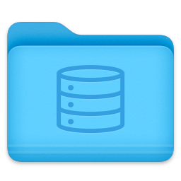
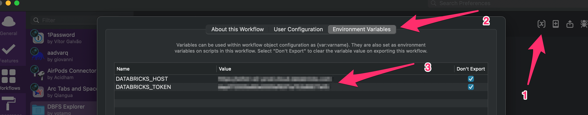
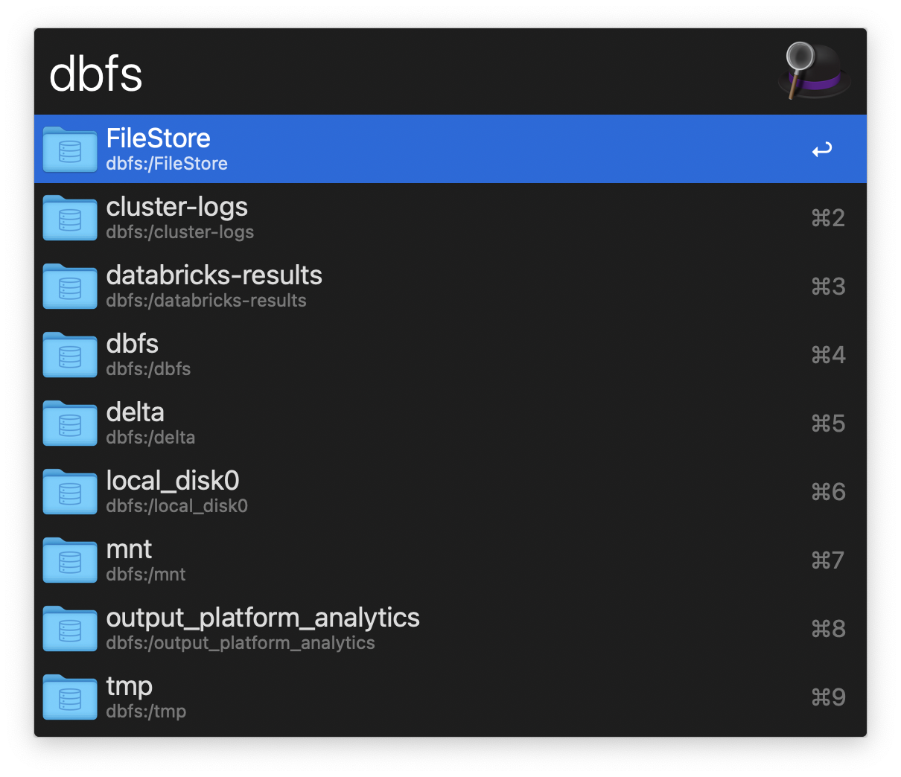

#  DBFS Explorer Alfred Workflow
Explore Databricks File System using Alfred

`Version 2023.03`

## Setup

- Install the databricks CLI in your local python enviornment by using `pip install databricks-cli`.
- setup your databricks host path and databricks token inside the workflow's enviornment variables.

- add your preffred DBFS directory inside the workflow configuration.

## Usage

- Explore your host's DBFS by initiating keyword (default: `dbfs`).
- Enter folders using <kbd>↩</kbd>.
- Return to DBFS root at any time by using <kbd>⌘</kbd><kbd>↩</kbd>.
- Quickly navigate to a preffered folder (set inside workflow configuration) by using <kbd>⌥</kbd><kbd>↩</kbd>.